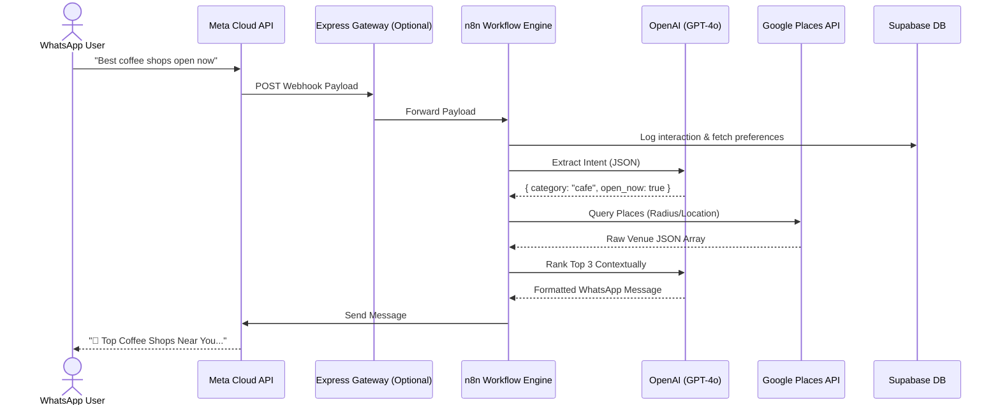

# Architecture Overview

This document outlines the high-level architecture of **LocalLens AI**, a WhatsApp-first AI assistant for business discovery. The system is designed using an event-driven automation architecture to ensure low latency, scalability, and ease of modification.

## System Components

### 1. The Gateway (API/Webhook Layer)
All messages sent by users on WhatsApp are routed through the Meta WhatsApp Cloud API to our webhook receiver.
- **Express API Wrapper**: Located in `/api`, this acts as a reverse proxy for n8n. It verifies Meta's subscription challenge and acts as a middleware for any custom pre-processing (like rate-limiting or signature validation) before forwarding the event to the core engine.
- **n8n Webhook Receivers**: Listen for validated payloads.

### 2. The Core Engine (n8n Workflows)
We use n8n to choreograph the entire pipeline visually and scalably. 
The core search functionality operates in a sequential state map:
1. **Event Ingestion**: Receives WhatsApp JSON payload.
2. **Intent & Entity Extraction (OpenAI)**: Uses `gpt-4o` with the `intent_detection.txt` prompt to turn natural language ("I want a cheap gym near Marina") into a structured JSON query object (category, budget, location).
3. **Data Retrieval (Google Places API)**: Takes the extracted metadata to trigger the `places:searchNearby` Maps endpoint. Returns up to 20 raw venue results.
4. **Ranking & Recommendation Engine (OpenAI)**: Passes the raw JSON venue list back to `gpt-4o` alongside the `ranking_recommendation.txt` prompt. The AI filters, ranks, and dynamically generate a 1-sentence personalized pitch for the top 3 best matching venues.
5. **Response Delivery**: Dispatches the customized text back to the user via the Meta WhatsApp Cloud API.

### 3. The Data Layer (Supabase/PostgreSQL)
A managed Postgres instance tracks user state:
- `users`: Tracks interacting phone numbers and timestamps.
- `search_logs`: Analytics for common queries to guide future feature development.
- `user_preferences` & `saved_places`: Enables the personalization subsystem (e.g., remembering a user only likes vegetarian restaurants or cheap budgets).

## Flow Diagram

## Scaling Considerations
- **n8n Workers**: As concurrent WhatsApp messages increase, n8n can be scaled horizontally using its queue mode (Redis + Postgres).
- **Caching**: Future implementation will cache Google Places results at the Express Gateway layer using Redis based on precise GEO hashes to reduce Google API costs.
- **Asynchronous Processing**: Meta requires a 200 OK within 3 seconds. n8n webhooks immediately return a 200 and process the flow asynchronously in the background.
